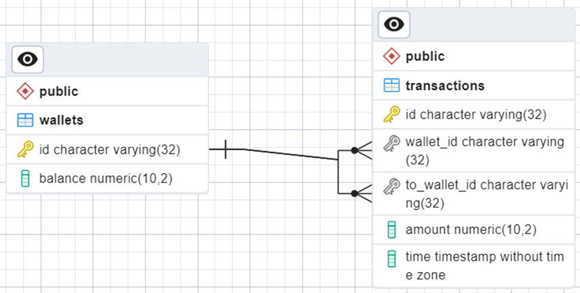

# EWallet Application
[RU](#русская-версия) | [EN](#english-version)

## <a name="english-version"></a> English version

The EWallet application implements a transaction processing system for the payment system. The application is an HTTP server implementing REST API.

## Technology Stack

- **Programming Language:** Go
- **Web Framework:** Gin
- **Database Management System:** PostgreSQL
- **ORM:** gorm
- **UUID Library:** uuid
- **Mock Framework:** gomock
- **Mock Generator:** mockgen
- **Assertion and Testing Library:** testify/assert
- **Library for Working with Environment Variables:** godotenv

## Database and ER Diagram

The application uses PostgreSQL as the database management system to store data. A database with two tables is created: `wallets` and `transactions`. The structure and relationships of the tables are depicted in the ER diagram.



## Gin Web Framework

Gin web framework is used for implementing the HTTP server. Gin allows for easy creation and handling of requests, ensuring high performance. An example of using Gin is presented in the `api/wallet.go` file.

## GORM and Database Binding

GORM, an Object-Relational Mapping tool, is used for interacting with the database. GORM enables mapping data structures in Go to database tables, facilitating query execution and ensuring data security. An example of using GORM is presented in the `db/database.go` file, where methods for database operations are defined.

## Generating Unique Identifiers

The `github.com/google/uuid` library is used for generating unique identifiers in the project. This library provides functionality for working with Universally Unique Identifiers (UUIDs), which are unique identifiers used for object identification in the system. The generated UUIDs have hyphens removed using a function. This process of generating UUIDs without hyphens is applied to ensure compatibility with the format specified in the OpenAPI file.

## Project Structure

The project is divided into the following directories:

- `api`: Contains HTTP request handlers.
- `models`: Defines structures representing wallets and transactions.
- `handlers`: Contains request handlers, including logic for creating wallets, transferring funds, and retrieving transaction history.
- `utils`: Auxiliary utilities, including handling HTTP responses.
- `db`: Contains code for interacting with the database, including interface definitions, mocks, and connection settings.
- `images`: For storing images used in the README.

## Roles of Important Files and Directories

- `api/wallet.go`: Contains logic for handling HTTP requests related to wallets.
- `utils/response.go`: Provides convenient functions for generating HTTP responses with various statuses and error messages.
- `db/database.go`: Defines the database interface, its implementation, and methods for executing queries.
- `db/.env`: File with environment variables for storing data, such as database connection parameters.
- `db/mocks/mock_db.go`: Contains mocks for database interfaces used in unit tests.
- `models/wallet.go`: Defines data structures for wallets and transactions.
- `main.go`: Entry point of the application, where the HTTP server and request handlers are initialized.

## Summary of Request Handlers Logic

The `handlers/wallet_handler.go` file implements four methods for handling core wallet operations:

1. Creating a Wallet: `CreateWallet`
2. Transferring Funds: `SendMoney`
3. Retrieving Transaction History: `GetTransactionHistory`
4. Retrieving Wallet Balance: `GetWalletBalance`

## Unit Tests

Simple unit tests are written, presented in the `handlers/wallet_handler_test.go` file, for the four main methods using a mock database. The tests cover the main scenario and do not consider unsuccessful scenarios of user parameter input.

## Dockerfile

Docker is used to create the application image. The Dockerfile uses two stages to make the image as lightweight as possible: a build stage, using `golang:1.21.6-alpine` as the base image for building the application, and a run stage, using a minimal `alpine` image as the base. The final image contains only the executable file and the minimal set of dependencies required for its execution.

To build a Docker image using Dockerfile, run the following command in the same directory where your Dockerfile is located:

```bash
docker build -t ewallet:v1 .
```

If PostgreSQL is installed on your host os, you can launch the container with the application using the following command

```bash
docker run -e DB_HOST=<your_db_host> -e DB_PORT=<your_db_port> -e DB_USER=<your_db_user> -e DB_PASSWORD=<your_db_password> -e DB_NAME=<your_db_Name> -p 8080:8080 -p 5432:5432 b00a27ec29d8
```

It is important to remember that such a container use case is not secure and you should use orchestration tools in which you can run Postgres and it will be possible to hide confidential data. Kubernetes using secrets may be an example.

## Security

Parameterized queries are applied using GORM, ensuring security in interacting with the database. Encryption of confidential data, such as database connection parameters, is provided, for example, when using Kubernetes orchestration tools.

GORM ensures the use of parameterized queries to the database, eliminating the need for raw SQL queries and protecting the database from SQL injections.


## <a name="русская-версия"></a> Русская Версия

Перейти к [английской версии](#english-version)

Приложение EWallet реализует систему обработки транзакций платёжной системы. Приложение представляет собой HTTP-сервер, реализующий REST API.

## Технологический стек

- **Язык программирования:** Go
- **Веб-фреймворк:** Gin
- **СУБД:** PostgreSQL
- **ORM:** gorm
- **UUID библиотека:** uuid
- **Мок-фреймворк:** gomock
- **Генератор моков:** mockgen
- **Библиотека утверждений и тестирования:** testify/assert
- **Библиотека для работы с переменными окружения:** godotenv

## База данных и ER-диаграмма

Приложение использует СУБД PostgreSQL для хранения данных. Создана база данных с двумя таблицами: `wallets` (кошельки) и `transactions` (транзакции). Структура и связи таблиц отображены на ER-диаграмме.


## Веб-фреймворк Gin

Для реализации HTTP-сервера используется веб-фреймворк Gin. Gin позволяет легко создавать и обрабатывать запросы, обеспечивая высокую производительность. Пример использования Gin представлен в файле `api/wallet.go`.

## GORM и Связывание с Базой Данных

Для взаимодействия с базой данных используется ORM (Object-Relational Mapping) GORM. GORM позволяет связать структуры данных в Go с таблицами в базе данных, облегчая выполнение запросов и обеспечивая безопасность данных. Пример использования GORM представлен в файле `db/database.go`, где определены методы для выполнения операций в базе данных.

## Генерация Уникальных Идентификаторов

Для генерации уникальных идентификаторов в проекте используется библиотека `github.com/google/uuid`. Эта библиотека предоставляет функционал для работы с UUID (Universally Unique Identifier) — уникальным идентификатором, который используется для идентификации объектов в системе. В сгенерированном UUID удаляются дефисы с использованием функции. Данный процесс генерации UUID без дефисов применяется, чтобы обеспечить совместимость с форматом, указанным в OpenAPI файле.

## Структура Проекта

Проект разбит на следующие директории:

- `api`: содержит обработчики HTTP-запросов.
- `models`: определяет структуры, представляющие кошельки и транзакции.
- `handlers`: содержит обработчики запросов, включая логику для создания кошелька, перевода средств и получения истории транзакций.
- `utils`: вспомогательные утилиты, включая обработку HTTP-ответов.
- `db`: содержит код для взаимодействия с базой данных, включая определение интерфейсов, моков и настройки подключения.
- `images`: для хранения изображений, используемых в README.

## Роли важных файлов и директорий

- `api/wallet.go`: содержит логику для обработки HTTP-запросов, связанных с кошельками.
- `utils/response.go`: предоставляет удобные функции для формирования HTTP-ответов с различными статусами и сообщениями об ошибках.
- `db/database.go`: определяет интерфейс базы данных, его реализацию и методы для выполнения запросов.
- `db/.env`: файл с переменными окружения для хранения данных, таких как параметры подключения к базе данных.
- `db/mocks/mock_db.go`: содержит моки для интерфейсов базы данных, используемые в юнит-тестах.
- `models/wallet.go`: определяет структуры данных для кошельков и транзакций.
- `main.go`: точка входа в приложение, где инициализируется HTTP-сервер и обработчики запросов.

## Логика обработчиков вкратце

В файле `handlers/wallet_handler.go` реализованы четыре метода для обработки основных операций с кошельками:

1. Создание Кошелька: `CreateWallet`
2. Перевод Средств: `SendMoney`
3. Получение Истории Транзакций: `GetTransactionHistory`
4. Получение Состояния Кошелька: `GetWalletBalance`

## Unit-Тесты

Написаны простые unit-тесты, приведенные в `handlers/wallet_handler_test.go` для четырех основных методов, используя мнимую базу данных с использованием моков. Тесты покрывают основной сценарий и не рассматривают неуспешные сценарии заполнения параметров пользователем.

## Dockerfile

Используется Docker для создания образа приложения. В созданном Dockerfile используется два этапа, чтобы сделать образ максимально легковесным: Этап сборки, с использованием `golang:1.21.6-alpine` в качестве базового образа для сборки приложения, а также этап запуска, с использованием минимального образа `alpine`, в качестве базового. В финальном образе остается исполняемый файл и минимальный набор зависимостей, необходимых для его выполнения.

Чтобы собрать Docker-образ, используя Dockerfile, выполните следующую команду в той же директории, где находится ваш Dockerfile:

```bash
docker build -t ewallet:v1 .
```

Если на Вашей операционной системе установлен PostgreSQL то вы можете запустить контейнер с приложением с помощью следующей команды

```bash
docker run -e DB_HOST=<ваш_db_host> -e DB_PORT=<ваш_db_port> -e DB_USER=<ваш_db_user> -e DB_PASSWORD=<ваш_db_password> -e DB_NAME=<ваш_db_Name> -p 8080:8080 -p 5432:5432 b00a27ec29d8
```

Важно помнить, что такой вариант использования контейнера не является безопасным и следует использовать средства оркестрации, в которых можно будет запустить Postgres и будет возможность скрыть конфиденциальные данные. В качестве примера может подойти kubernetes с использованием secrets

## Безопасность

Применяются параметризованные запросы с использованием GORM, обеспечивая безопасность взаимодействия с базой данных. Предусмотрено шифрование конфиденциальных данных, таких как параметры подключения к базе данных, например, при использовании средств оркестрации Kubernetes.

GORM обеспечивает использование параметризованных запросов к базе данных, что позволяет не использовать чистые SQL запросы и защищает базу данных от SQL-инъекций.


При создании docker image и запуске docker контейнера необходимо предусмотреть защиту конфиденциальных данных, таких как адрес сервера базы данных, порт прослушиваемый базой данных, имя пользователя, которое приложение будет использовать для подключения к базе данных, пароль для пользователя базы данных, имя базы данных. Если собранный docker image будет использоваться kubernetes, то можно использовать секреты для защиты этой информации. Секреты в kubernetes сохраняются в зашифрованном виде в хранилище etcd. Доступ к секретам также можно будет настроить через роли (Roles) и разрешения (RoleBinding), также можно настроить ограниченный доступ на уровне кластера.

Если будет использоваться контейнерная версия PostgreSQL в среде Kubernetes, это может облегчить задачу взаимодействия между приложением EWallet и базой данных PostgreSQL. Так, Kubernetes предоставляет абстракцию "Сервис", которая позволяет вашим приложениям общаться с другими службами в кластере по именам сервисов. Если ваше приложение EWallet и PostgreSQL находятся в одном кластере Kubernetes, вы можете использовать DNS-имена сервисов для облегчения взаимодействия между ними.
